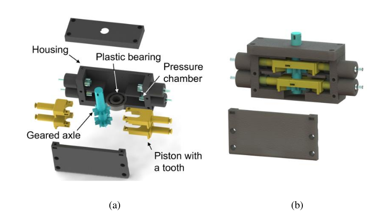
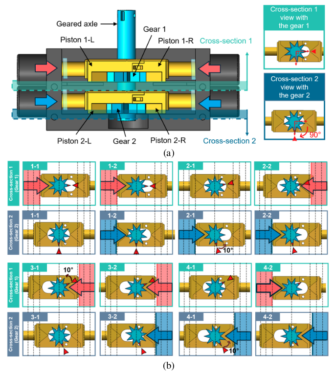
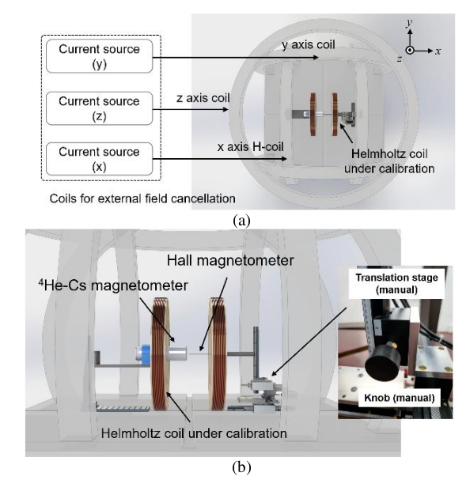
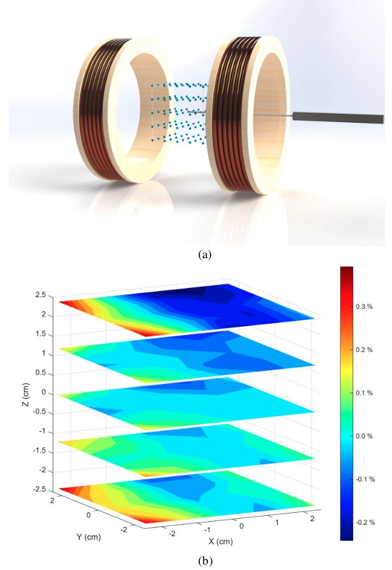

  * Corresponding Authors

  

    Under Review
  

  <a href="#" target="_blank" rel="noopener noreferrer"
     style="display: inline-block; margin: 0 0.4rem 0.6rem 0.4rem; padding: 0.75rem 1.6rem; background-color: #363636; color: white; border-radius: 999px; text-decoration: none; font-weight: 600; font-size: 1rem; box-shadow: 0 2px 6px rgba(0,0,0,0.12);">
    Paper
  </a>

<section class="hero teaser">
  

    

      <h2 class="subtitle has-text-centered mt-3 is-size-6" style="color: #AE3A5D;">
        <strong>Nonmagnetic 3D Scanning System for Magnetic Field Calibration</strong>
      </h2>
    

  

</section>

  

    <h2 class="title is-3">Abstract</h2>
    

      This study presents an automated scanning system for the measurement of magnetic field uniformity in a Helmholtz coil using a nonmagnetic pneumatic stepper motor. To avoid magnetic interference commonly introduced by electric motors, a custom-designed pneumatic stepper motor fabricated with nonmagnetic materials was employed to implement a three-dimensional scanning stage that moves the Hall sensor within the measurement volume of the Helmholtz coil. The stage automatically scanned a 4.8 × 4.8 × 4.8 cm³ volume by moving the Hall sensor in 1.2 cm increments along each axis. A total of 125 measurements were performed to complete a scan. The measured magnetic field uniformity of the tested Helmholtz coil was within ±0.43%, which is consistent with the manually scanned result within the uncertainty of the magnetic field measurement. The automatic stage reduced the total scanning time from 90 minutes to 50 minutes and the human intervention time from 90 minutes to 10 minutes. The uncertainty of the magnetic field measurement was also reduced by increasing the number of readings from the Hall sensor without a significant increase in measurement time.
    

  

## Framework & System Design

  

    The automated scanning system was designed to eliminate magnetic disturbances caused by conventional electric actuators in low-field magnetic measurements. The core of this system is a custom-designed pneumatic stepper motor driven by compressed air.
  

  <ul>
    <li><strong>Nonmagnetic Construction:</strong> The motor is fabricated using 3D-printed ABS and PLA components, plastic bearings, and commercially available syringes that serve as pressure chambers.</li>
    <li><strong>Operating Principle:</strong> The motor utilizes four pneumatic pistons. By applying sequential air pressure to these pistons, it executes a "Lock-Push-Release" mechanism to achieve bi-directional stepwise rotation of the geared axle.</li>
    <li><strong>Remote Control:</strong> The system is controlled by pneumatic regulators located outside the magnetically shielded room to prevent electrical interference during the calibration process.</li>
  </ul>

  

    <figure>
      
      <figcaption style="margin-top: 0.75rem; font-size: 0.92rem; color: #444; line-height: 1.6;">
        <strong>Fig. 3.</strong> Structure of the designed pneumatic stepper motor: (a) an exploded view and (b) an assembled view with the internal structure exposed.
      </figcaption>
    </figure>
  

  

    <figure>
      <video src="static/image/pneumatic_motor.mp4" autoplay muted loop playsinline style="width: 100%; border-radius: 6px; box-shadow: 0 2px 8px rgba(0,0,0,0.1);"></video>
      <figcaption style="margin-top: 0.75rem; font-size: 0.92rem; color: #444; line-height: 1.6;">
        <strong>Video.</strong> Demonstration of the nonmagnetic pneumatic stepper motor in operation.
      </figcaption>
    </figure>
  

  

    The motor's stepping mechanism is based on two sets of gears with a 10° rotational offset. This design allows sequential piston actuation to produce controlled incremental rotation, enabling precise linear translation of the sensor stage.
  

  

    <figure>
      
      <figcaption style="margin-top: 0.75rem; font-size: 0.92rem; color: #444; line-height: 1.6;">
        <strong>Fig. 4.</strong> (a) Top view of the designed motor and views of cross-section 1 and cross-section 2 with the corresponding gears. Gear 2 is rotated by 90&deg; relative to Gear 1, which causes a rotational misalignment between Gear 1 and 2 of 10&deg;. (b) Illustration of the movement of the gears at each step corresponding to the sequential pressure applied to the pistons from step 1-1 to 4-2.
      </figcaption>
    </figure>
  

 

## Experiments & Measurement Protocol

  

    

      

        

          The proposed system was experimentally validated at the Korea Research Institute of Standards and Science (KRISS). The automated translation stage was attached to the Helmholtz coil calibration setup to map the working volume.
        

      

    

  

  

    <figure>
      
      <figcaption style="margin-top: 0.75rem; font-size: 0.92rem; color: #444; line-height: 1.6;">
        <strong>Fig. 1.</strong> (a) Measurement system for the calibration of Helmholtz coils. The DUT Helmholtz coil is placed inside the cancellation coils with a diameter of 2 m to suppress external magnetic interference. Each coil is independently driven by a precision current source. (b) A Cs-4He magnetometer, used as a reference for coil constant measurement, and a Hall sensor attached to a three-dimensional manual translation stage installed inside the cancellation coils.
      </figcaption>
    </figure>
  

  

    

      The scanning protocol involved calculating the Relative Deviation of the magnetic flux density (RDB) across a 3D grid. The sensor automatically navigated 125 distinct positions, measuring the spatial variation of the generated magnetic field relative to the center point. Because the system is automated, it enabled a higher number of sensor readings per point (20 instead of 5) without increasing the overall measurement time.
    

  

  

    <figure>
      
      <figcaption style="margin-top: 0.75rem; font-size: 0.92rem; color: #444; line-height: 1.6;">
        <strong>Fig. 2.</strong> (a) Three-dimensional grid of 125 measurement points for evaluation of magnetic field uniformity in the KRISS Helmholtz coil. (b) Three-dimensional plot of RDBs measured by manually scanning the 125 points in the grid.
      </figcaption>
    </figure>
  

<h2 class="title is-3 has-text-centered mt-6 mb-5">Results</h2>

  

    

      The automated scanning results were compared with the manual scanning baseline. The measured magnetic field uniformity was within ±0.43% for both methods, confirming that the pneumatic motor introduced no measurable magnetic interference. The automated system also reduced measurement uncertainty from ±0.11% to ±0.06% by collecting more readings per position.
    

  

  

    

      In terms of time efficiency, the total scanning time was reduced from 90 minutes to 50 minutes, while the required human intervention time decreased dramatically from 90 minutes to just 10 minutes. Regarding measurement uncertainty, the magnetic field uniformity was confirmed to be within ±0.43%, which is consistent with the manual scanning result. Furthermore, by increasing the number of readings per measurement point to 20, the measurement uncertainty was reduced from ±0.11% to ±0.06%, demonstrating an improvement in measurement reliability without a significant increase in total scanning time.
    

  

